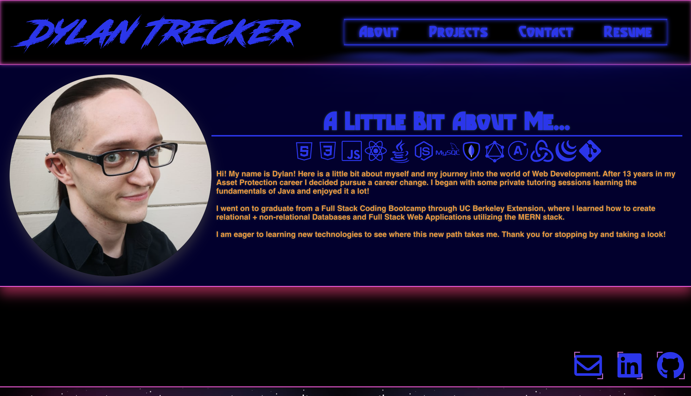

# Trecker React Portfolio

## General 

My personal react portfolio for showcasing my latest work.

## Table of Contents

- [Description](#description)
- [Setup](#setup)
- [Technologies](#technologies)
- [Links](#links)
- [Contact](#contact)
- [Preview](#preview)

### Setup
To run locally: 
* Start by cloning the repo by using the commands:
* `$ git clone git@github.com:d-trecker/dt-portfolio.git`
* From the root directory of the cloned repo, use the command `npm i` 
* Run `npm start` 

### Technologies
Created  with: 
* react: ^17.0.2
* react-dom: ^17.0.2
* react-scripts: 4.0.3
* react-router-dom: ^5.2.0
* fontawesome-free: ^5.15.4
* framer-motion: ^4.1.17

### Links
Repo Link: https://github.com/d-trecker/dt-portfolio.git  
Deployed Link: https://d-trecker.github.io/dt-portfolio/  

### Contact
Feel free to drop me a line @ [dylan.j.trecker@gmail.com](mailto:dylan.j.trecker@gmail.com?subject=[GitHub]%20Trecker%20Portfolio)

### Preview

